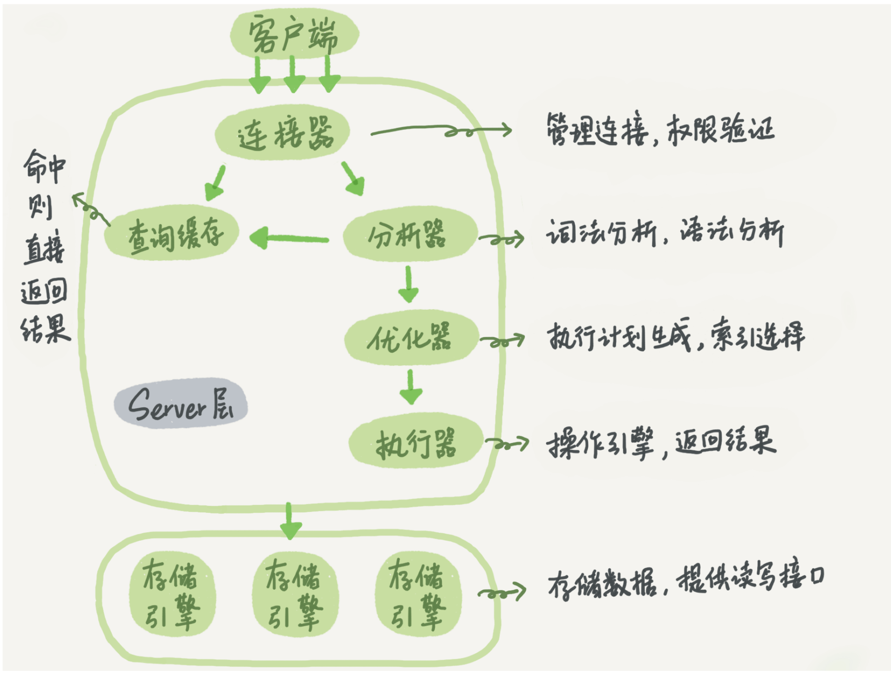

### mysql架构图





### 数据库范式设计

#### 1.1第一范式

定义： 属于第一范式关系的所有属性都不可再分，即数据项不可分。

```
满足原子性
```

#### 1.2第二范式

定义：要求实体的属性完全依赖于主关键字。

```
拆分成中间表 属性值完全依赖主键
```

#### 1.3.第三范式

定义：要求一个数据库表中不包含已在其它表中包含的非主关键字信息，即数据不能存在传递关系，即每个属性都跟主键有直接关系而不是间接关系。